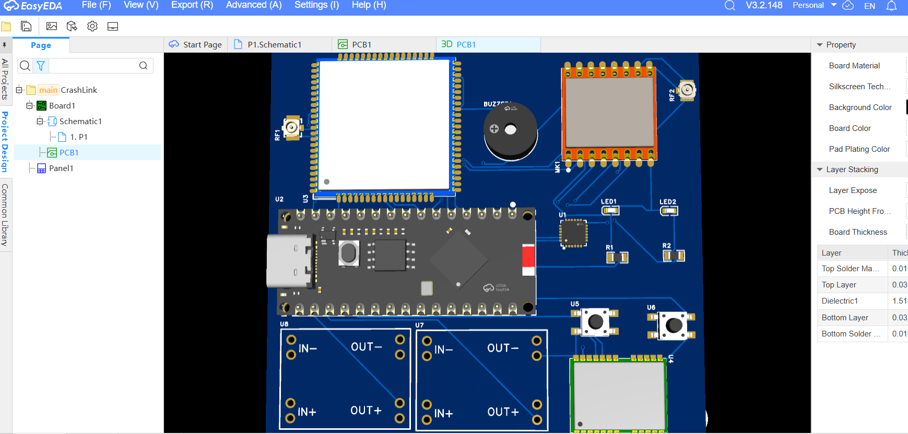
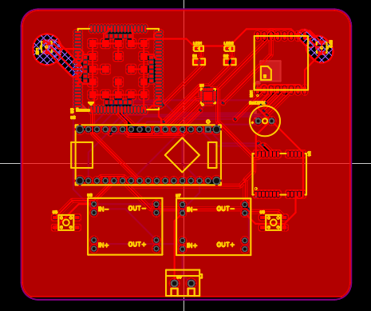

# June 3: The Origin of idea & setting up github repo

Was walking on the roof and suddenly it clicked.
The road safety AI Hackathon I read about few days ago.
I wrote down the ideas came to my head.
How an automatic alert can save many people who
die cause no help reach to them quickly due to late information about crashes etc.

**Total time spent: 2 hours**

# June 4: Github setup & learning basic commands

Spent few hours making nice structure of github repository.
This was my first time doing this so took help of AI to know whats the ideal way of doing it.

**Total time spent: 3 hour**

# June 5: VS code setup and some coding aswell

Spent good time setting up VS code setup
also did some coding not much just wrote structure for all 3 nodes.
Did a bit extra for Vehicle node and added Detect crash function for it.

**Total time spent: 3 hours 25 min**

# June 6: PCB design for Vehicle node
It felt i forgot everything coz last time i designed was 1.5 years ago.
somehow I managed to do it although in the end i couldnt fine how to place hole in this easy eda pro software.

**Total time spent: 4hr 30min**

# June 7 : Architecture Diagram
Used draw.io to draw diagram of How the whole system will work. I felt amazing after looking at it because it simplified everything in the brain and I could feel the flow of commmunications through it.

**Total time spent: 3hr 20min**

# June 8 : Revised vechicle node PCB & Made Relay Node PCB
I redesigned the Vehicle node PCB and Revised its schematics. I basically re organized the components in Schematics dividing it into different sections like communication,power,etc... 
Also i made Relay Node PCB schematics and PCB design

then I pushed the vehicle node PCB design gerbers and images to github.

**Total time spent: 6hr 10min**

# June 9 : Documentation => Wrote README.md and spent some time reassesing pcb design
It is very frustrating to wite out and document things like this but I think this is what makes the other parts more intresting. so yeah i did wrote Readme folder and stared at PCB for few hours and yes very productive hours because i found nothing
also ended up unsatisfied with the README which i wrote.
**Total time spent: 2hr**

# June 10 : More Documentation => README, BOM
Spent some good time making BOM and in between i switched to making Readme and felt satifying then i got back to working on the BOM i think its finally done.

**Total time spent: 2hr 30min**

