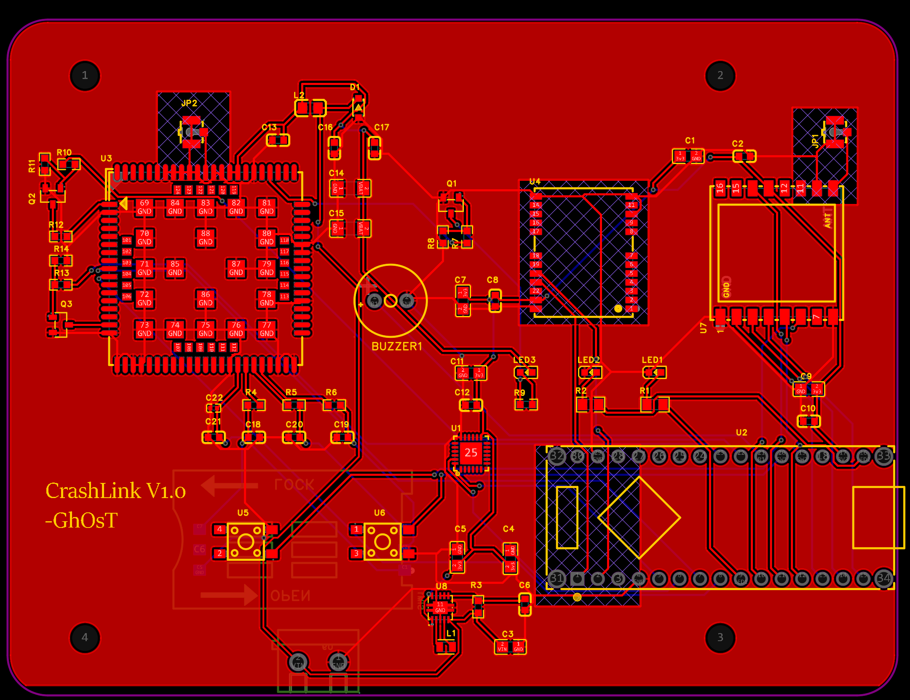
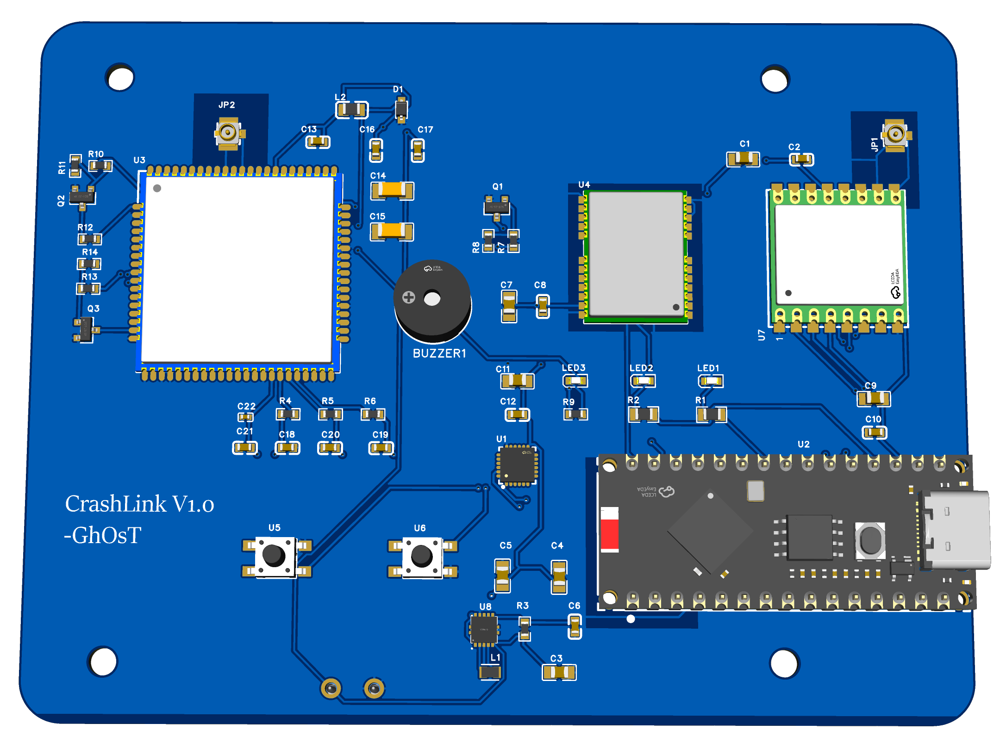
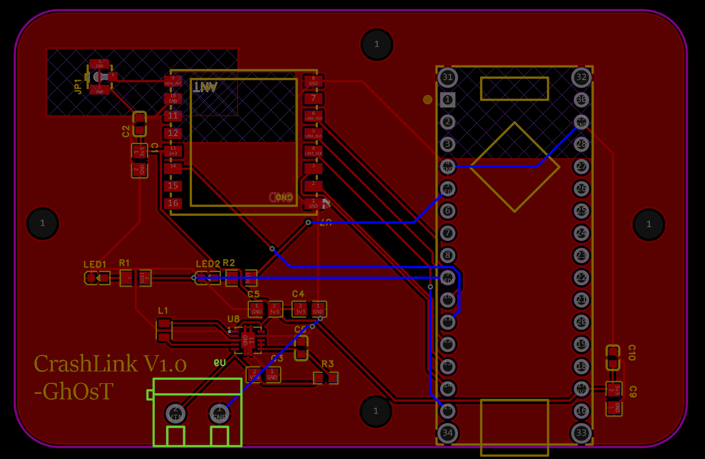
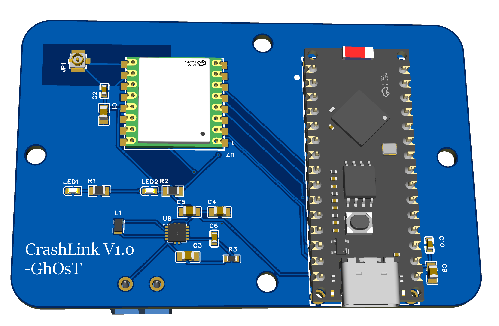
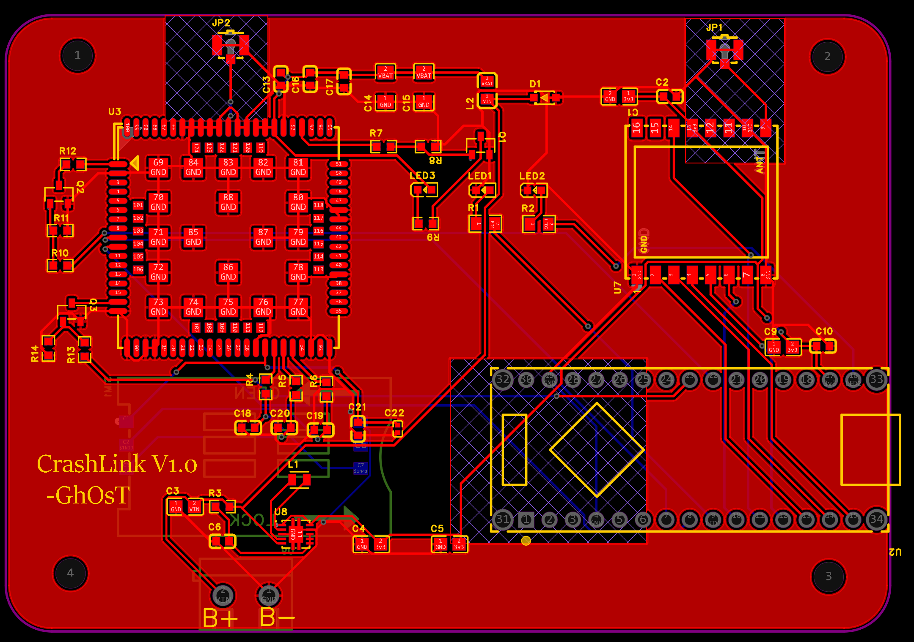
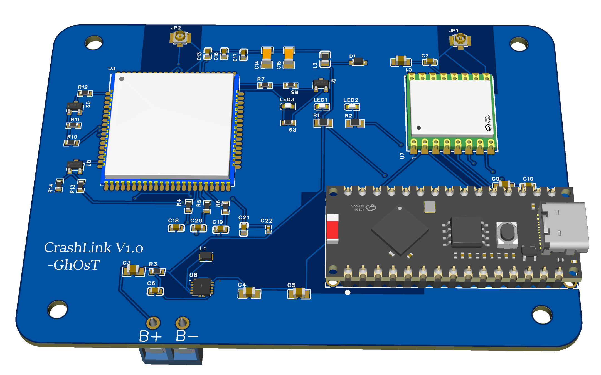

# CrashLink 

## Overview
CrashLink is a hybrid LTE + LoRa based emergency alert system.It enables accident alerts to be transmitted even from areas with no cellular network coverage.

## Problem
Many accidents happens in areas with low cellular connectivity which delays in the response time of emergency responders and fatality chances of victims incrreases significnatly.

## Solutions
CrashLink uses
-Vehicle nodes
-Relay nodes
-Gateway nodes

LTE is used when coverage exists. LoRa acts as a backup communication network when LTE is unavailable.

## Current Progress
- [x] System architecture designed
- [x] Vehicle Node schematic completed
- [x] Vehicle Node PCB designed
- [x] Vehicle Node gerbers generated
- [] Vehicle Node 3D Enclosure file generated
- [x] Relay Node schematics completed
- [x] Relay Node PCB designed
- [x] Relay Node gerbers generated
- [] Relay Node 3D Enclosure file generated
- [x] Gateway Node schematics completed
- [x] Gateway Node PCB designed
- [x] Gateway Node gerbers generated
- [] Gateway Node 3D Enclodure file generated
- [] Prototype assembly
- [] Firmware development

## Hardware

- ESP32
- SX1278 LoRa
- A7670C-LANS LTE
- NEO-6M GPS
- MPU6050

Detailed Bill of Materials : [bom.md](docs/bom.md)

## System Architecture

## Vehicle Node

### PCB View

### 3D Render

## Relay Node

### PCB View

### 3D Render

## Gateway Node

### PCB View

### 3D Render

