# CrashLink

Hybrid **LTE + LoRa** Emergency Alert System for Reliable Accident Reporting

---

## Overview

CrashLink is a hybrid LTE + LoRa emergency alert system designed to transmit accident alerts even in areas with poor or no cellular network coverage.

The system consists of three different node types that work together to ensure emergency messages reach responders through either LTE or a LoRa relay network.

---

## 🚨 Problem

Road accidents frequently occur in remote areas where cellular connectivity is unreliable or unavailable. This can delay emergency notifications, increasing response time and reducing the chances of timely medical assistance.

---

## 💡 Solution

CrashLink consists of three node types:

-  Vehicle Node
-  Relay Node
-  Gateway Node

When LTE coverage is available, alerts are sent directly over the cellular network.

If LTE is unavailable, CrashLink automatically switches to a LoRa relay network, forwarding the emergency message until it reaches a Gateway Node.

---

#  System Architecture

---

#  Vehicle Node

### PCB Layout

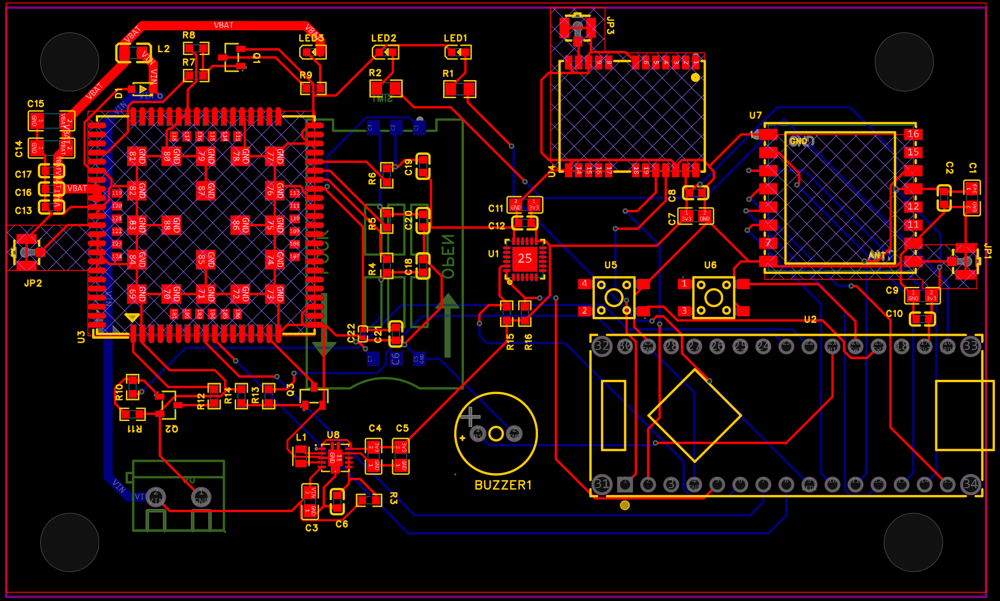

### PCB Views

| Top | Bottom |
|------|---------|
| 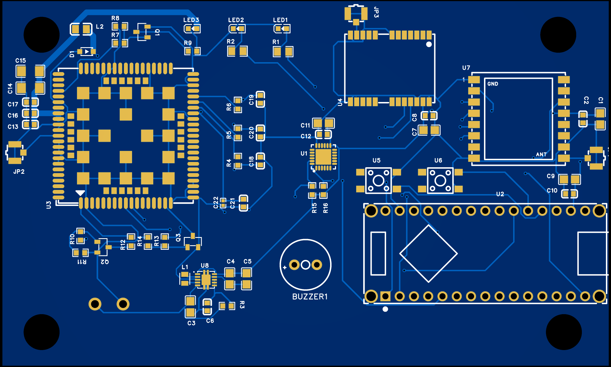 | 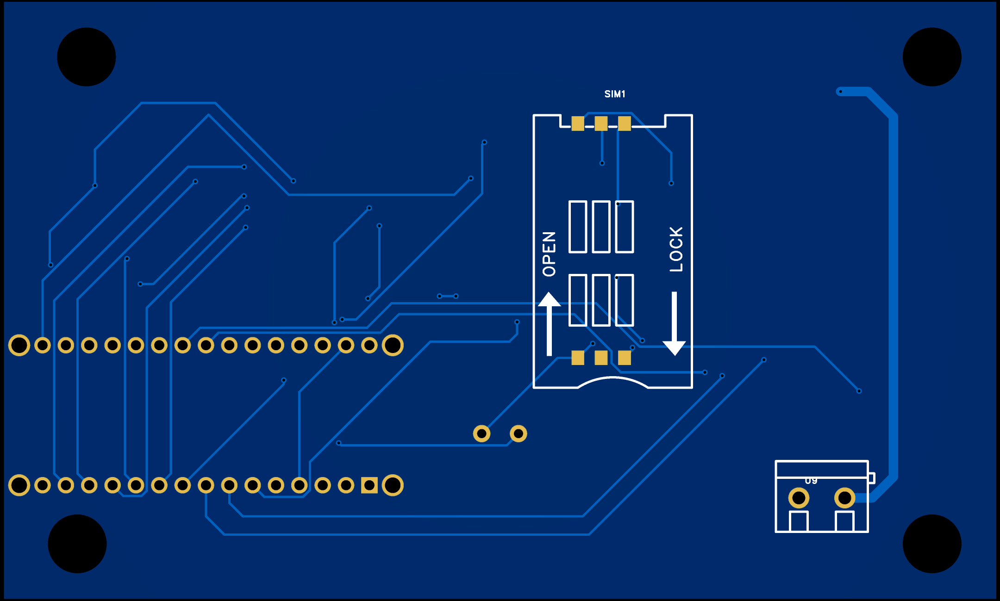 |

### 3D Model

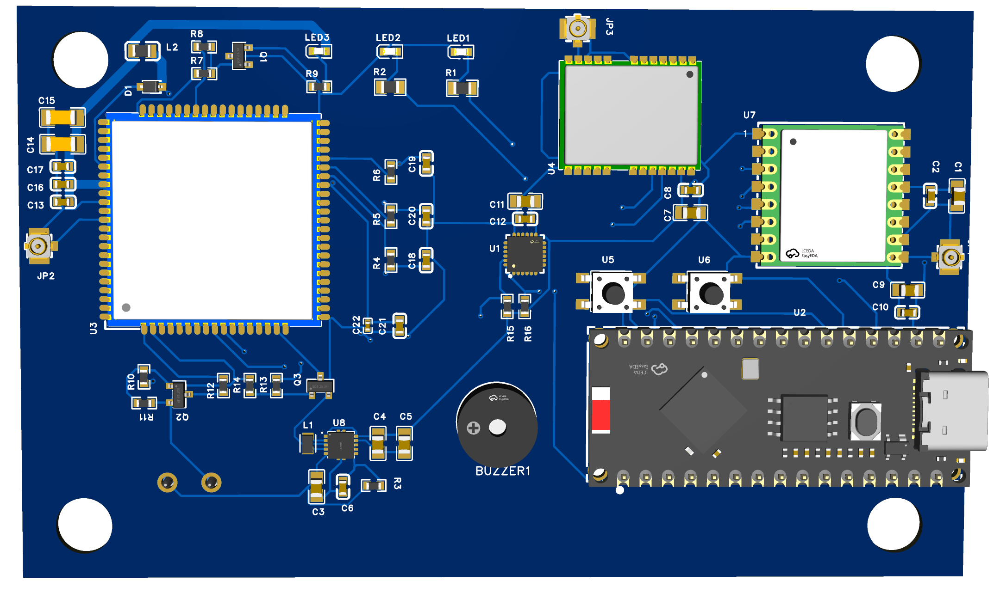

### Enclosure

---

#  Relay Node

### PCB Layout

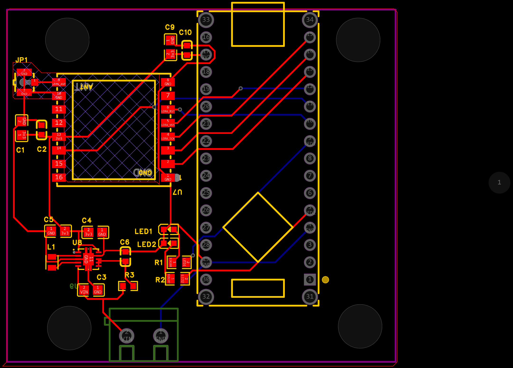

### PCB Views

| Top | Bottom |
|------|---------|
| 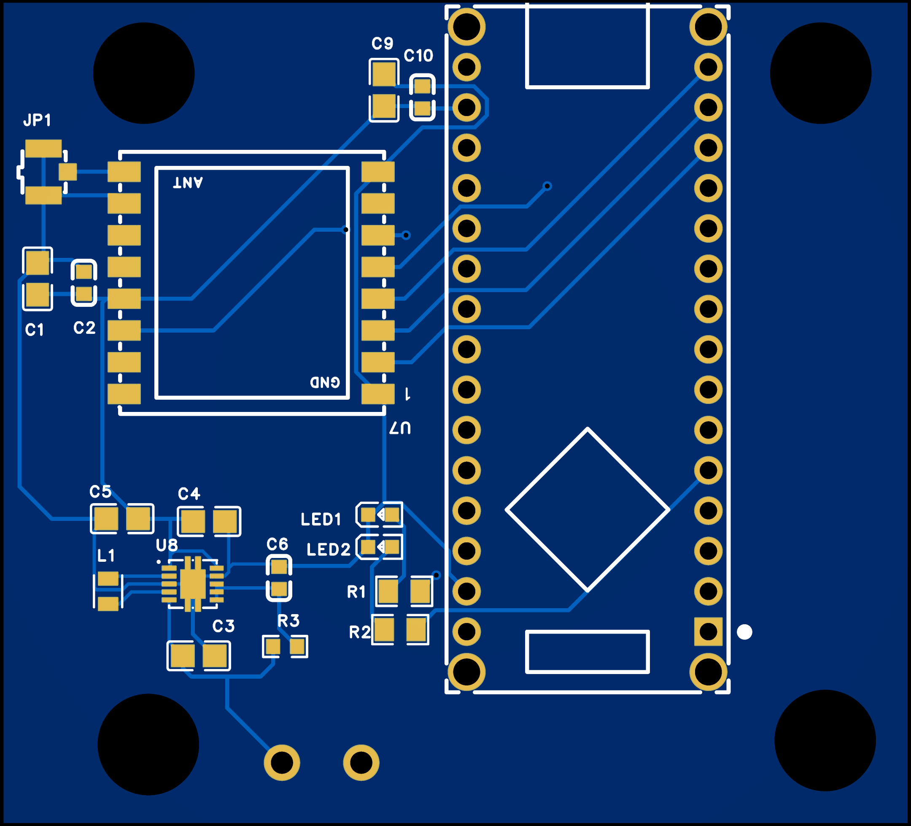 | 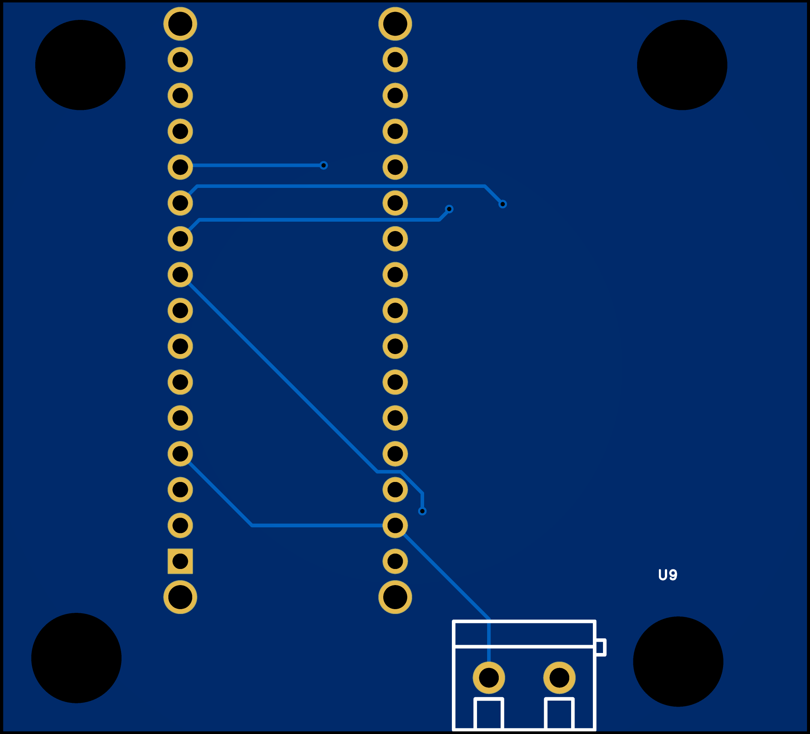 |

### 3D Model

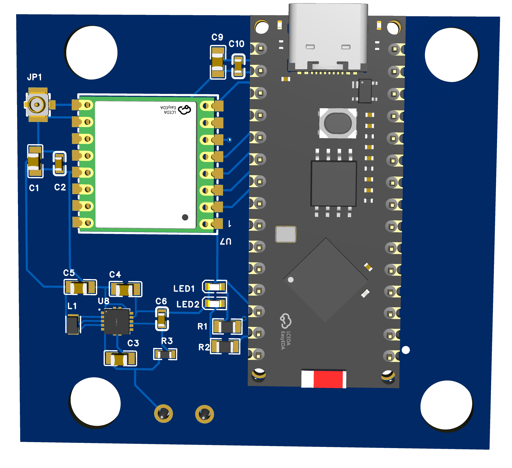

### Enclosure

---

#  Gateway Node

### PCB Layout

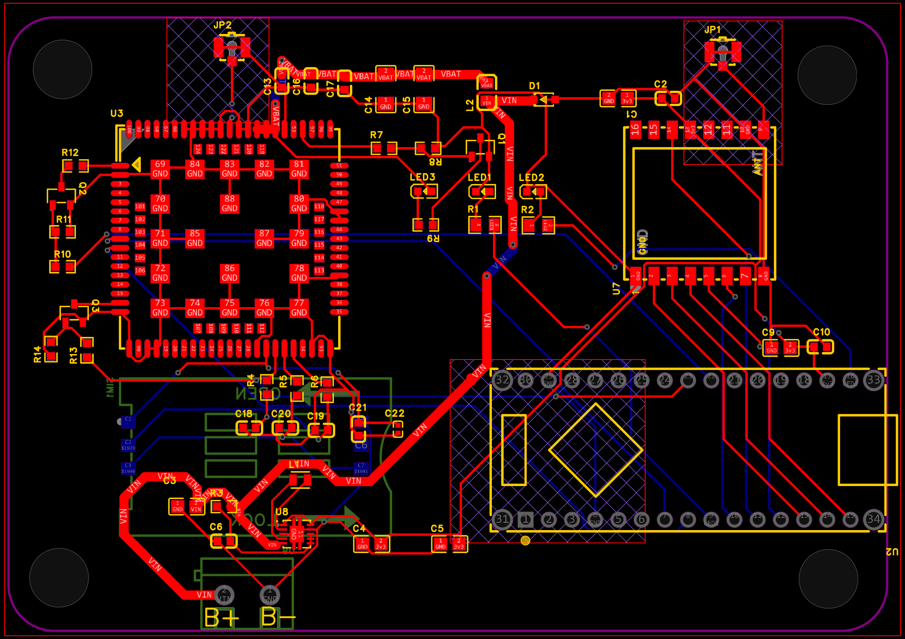

### PCB Views

| Top | Bottom |
|------|---------|
| 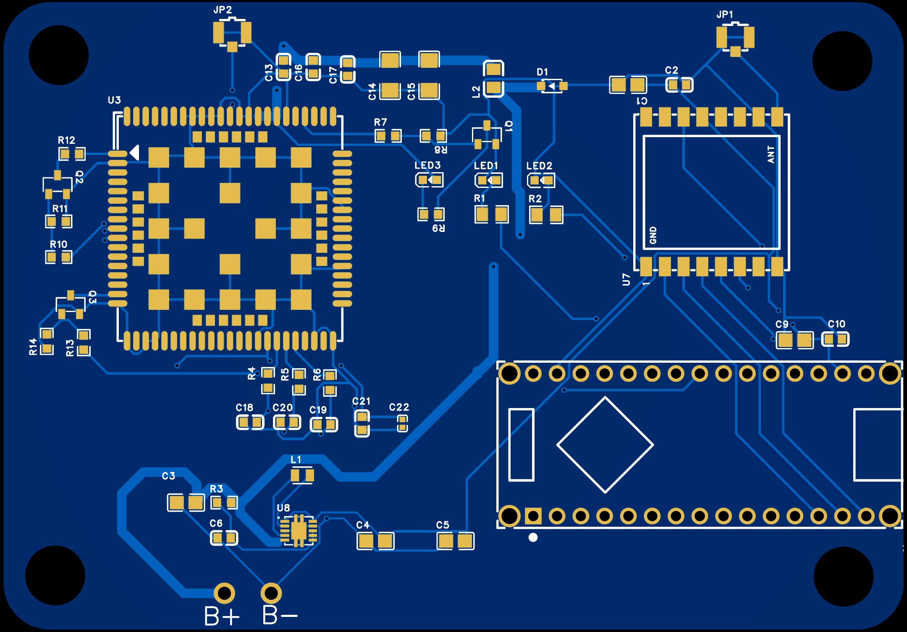 | 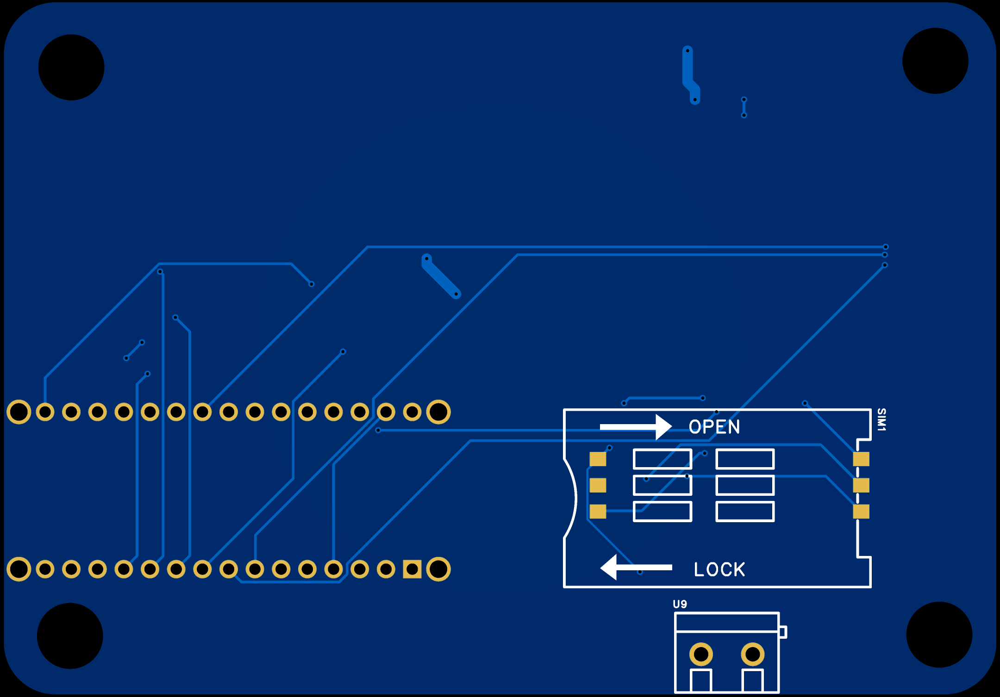 |

### 3D Model

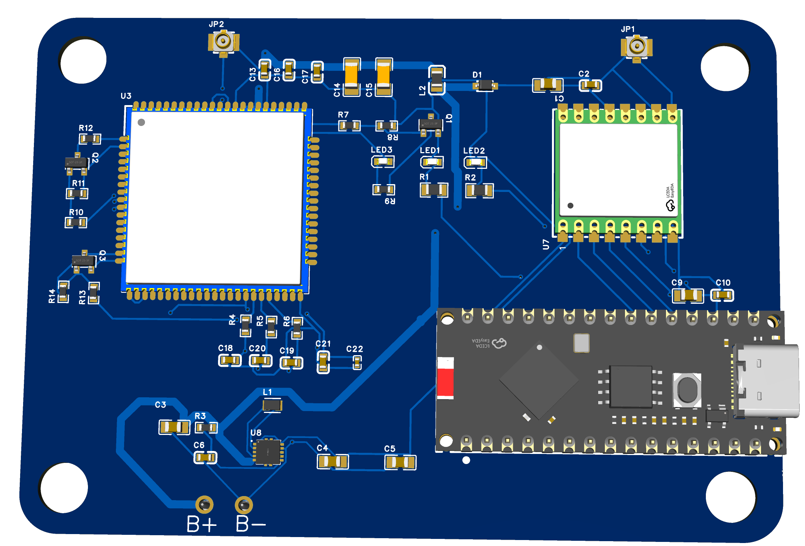

### Enclosure

---

# 📊 Current Progress

- [x] System architecture designed
- [x] Vehicle Node schematic
- [x] Vehicle Node PCB
- [x] Vehicle Node Gerbers
- [x] Vehicle Node enclosure
- [x] Relay Node schematic
- [x] Relay Node PCB
- [x] Relay Node Gerbers
- [x] Relay Node enclosure
- [x] Gateway Node schematic
- [x] Gateway Node PCB
- [x] Gateway Node Gerbers
- [x] Gateway Node enclosure
- [ ] Prototype assembly
- [ ] Firmware development
- [ ] Field testing

---

# 🔩 Hardware

- ESP32
- SX1278 LoRa Module
- A7670C-LANS LTE Module
- NEO-6M GPS Module
- MPU6050 IMU

📄 **Detailed Bill of Materials:** [docs/bom.md](docs/bom.md)

---

# 📜 License

This project is licensed under the MIT License.