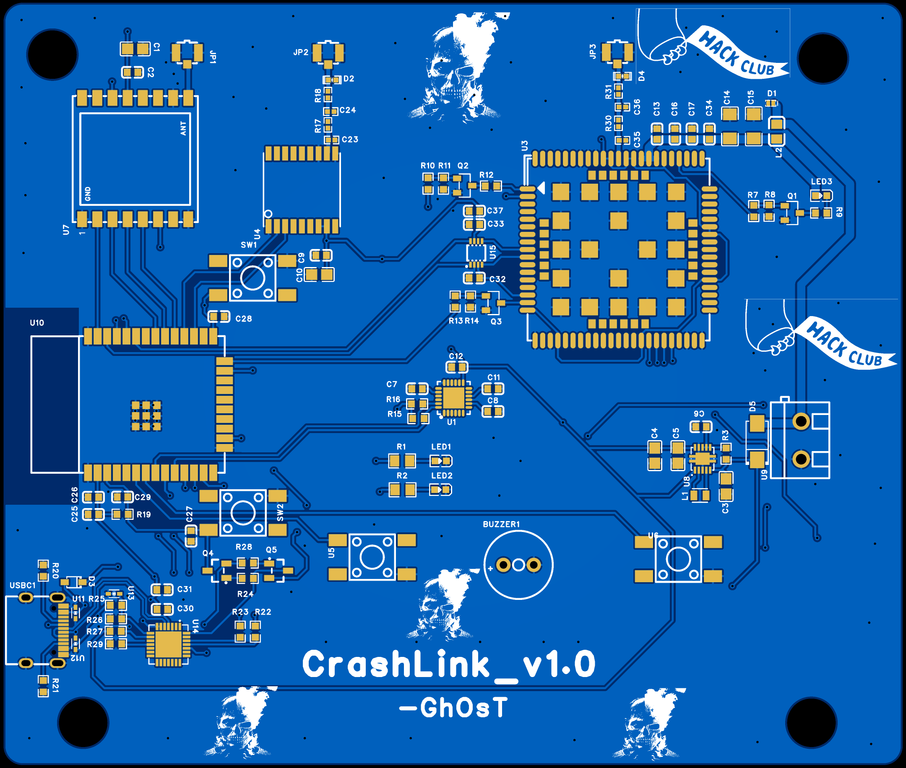
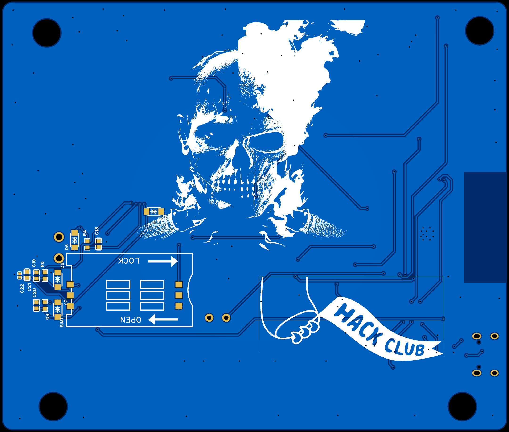
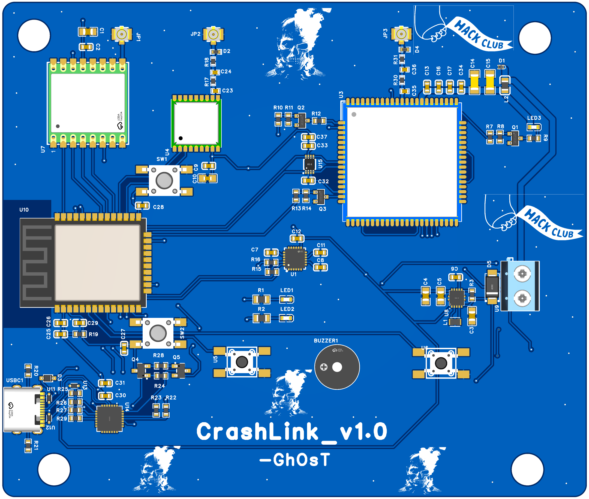
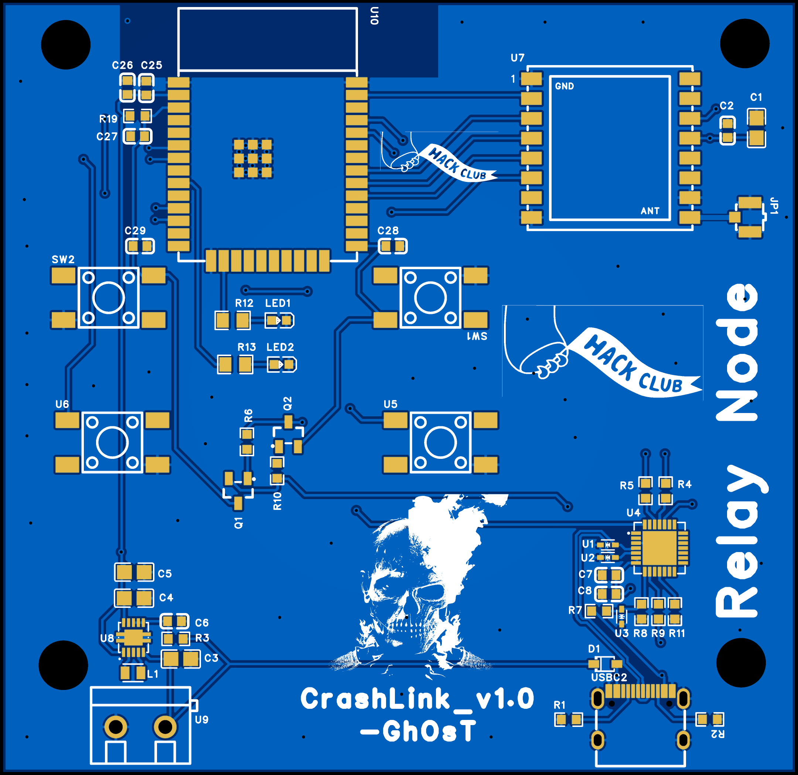
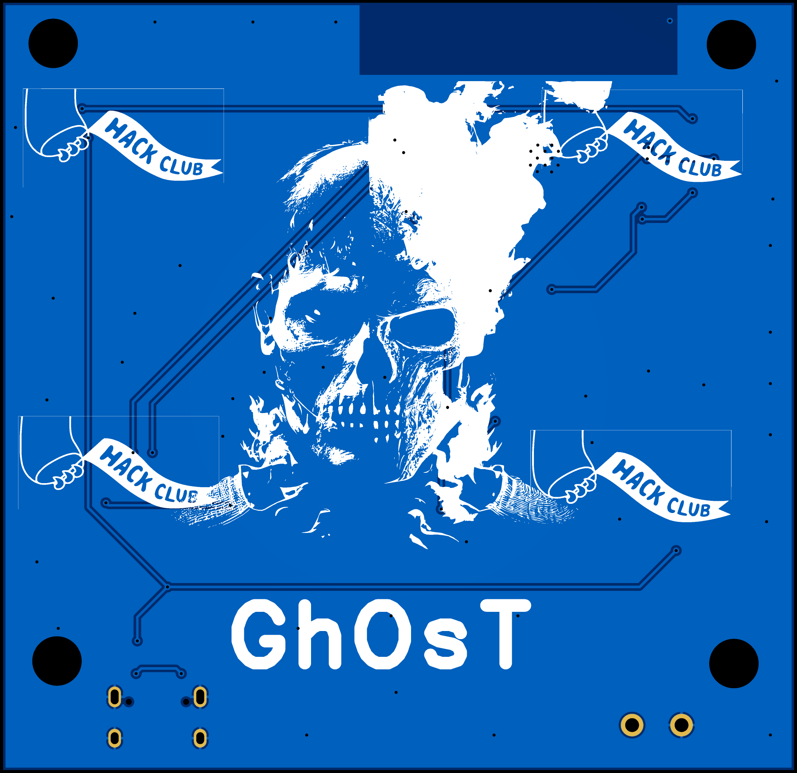
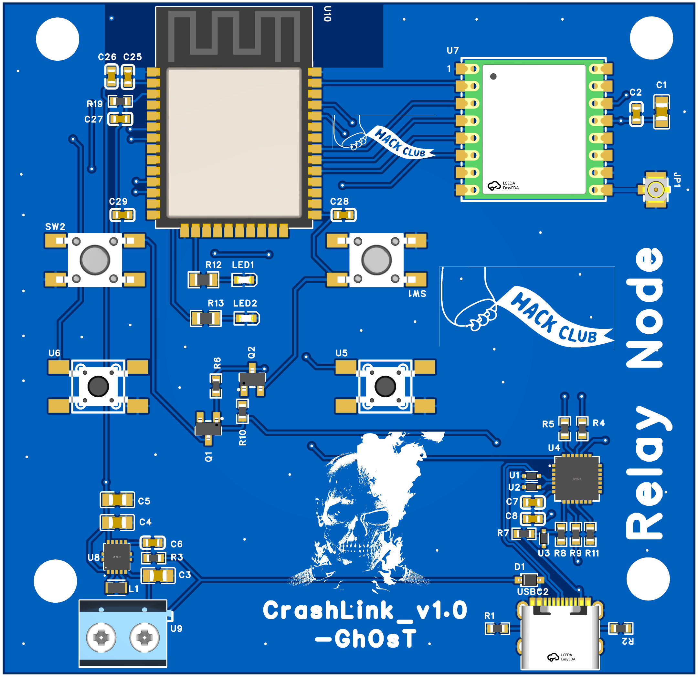

# CrashLink

Hybrid **LTE + LoRa** Emergency Alert System for Reliable Accident Reporting

---

## Overview

CrashLink is a hybrid LTE + LoRa emergency alert system designed to transmit accident alerts even in areas with poor or no cellular network coverage.

The system consists of three different node types that work together to ensure emergency messages reach responders through either LTE or a LoRa relay network.

---

##  Problem

Road accidents frequently occur in remote areas where cellular connectivity is unreliable or unavailable. This can delay emergency notifications, increasing response time and reducing the chances of timely medical assistance.

---

##  Solution

CrashLink consists of three node types:

-  Vehicle Node
-  Relay Node
-  Gateway Node

When LTE coverage is available, alerts are sent directly over the cellular network.

If LTE is unavailable, CrashLink automatically switches to a LoRa relay network, forwarding the emergency message until it reaches a Gateway Node.

---

#  System Architecture

---

#  Vehicle Node

### PCB Views

| Top | Bottom |
|------|---------|
|  |  |

### 3D Model

### Enclosure

---

#  Relay Node

### PCB Views

| Top | Bottom |
|------|---------|
|  |  |

### 3D Model

### Enclosure

---

#  Gateway Node

### PCB Views

| Top | Bottom |
|------|---------|
|  |  |

### 3D Model

### Enclosure

---

#  BOM

## Core Electronics
 | Component | Qty | Purpose | Estimated Cost($) |
 |-----------|-----|---------|-------------------|
 | ESP32 | 3 | vehicle, Relay, Gateway controller| $15 |
 | SX1278 LoRa Module | 3 | LoRa communication  | $18 |
 | A7670 LTE Module | 2 | Vehicle LTE, Gateway LTE | $28 |
 | MAX10S GPS Module | 1 | Vehicle GPS | $12 |
 | MPU6050 | 1 | Vehicle | $4 |
 | Buck converter | 5 | Vehicle 2, Relay 1, Gateway 2| $10 |
 
 ## RF Components
 | Component | Qty | Purpose | Estimated Cost($) |
 |-----------|-----|---------|-------------------|
 | LoRa antenna | 3 | vehicle, Relay, Gateway | $9 |
 | LTE Antenna | 2 | Vehicle, Relay, Gateway | $10 |
 | U.FL/IPEX Cable | 8 | Antenna connections | $16 |

 ## Power System
 | Component | Qty | Purpose | Estimated Cost($) |
 |-----------|-----|---------|-------------------|
 | Li-ion Battery | 3 | Power source 1 each for Vehicle, Relay & Gateway | $25 |
 | Battery Connector/Holder | 4 | Battery Integration | $3 |
 | BMS/Protection module | 3 | Battery protection | $4 |

## PCB Fabrication
| Component | Qty | Purpose | Estimated Cost($) |
 |-----------|-----|---------|-------------------|
 | Vehicle Node PCB | 5 | Protoype fabrication |$15  |
 | Relay Node PCB | 5 | Protoype fabrication | $10 |
 | Gateway Node PCB | 5 | Protoype fabrication | $15 |

## Mechanical Components
 | Component | Qty | Purpose | Estimated Cost($) |
 |-----------|-----|---------|-------------------|
 |3D Printed Vehicle Enclosure | 1 | Housing | $10 |
 |3D Printed Vehicle Enclosure | 1 | Housing | $8 |
 |3D Printed Vehicle Enclosure | 1 | Housing | $10 |
 | M3 Screws Nuts & Standoffs | 1 Kit | assembly | $2 |

## Assembly Components
 
 | Component | Qty | Purpose | Estimated Cost($) |
 |-----------|-----|---------|-------------------|
 | LEDs | 10 | status indication  | $1  |
 | Push Buttons | 5 | User interaction | $1 |
 | Header pins | 2 Packs | Module connections| $3 |
 | JST connectors | 10 | battery and Power connections| $2 |
 | Screw terminals | 10 | Wiring | $2 |
 | Jumper Wires | 1 Kit | Prototyping | $3 |
 | Heat Shrink Tubing | 1 Kit | wire insulation | $4 |

 ## Assembly Tools
 | Component | Qty | Purpose | Estimated Cost($) |
 |-----------|-----|---------|-------------------|
 | Soldering Station | 1 | PCB assembly | $45 |
 | Solder Wire | 1 | Soldering | $5 |
 | Flux | 1 | Soldering | $5 |
 | Fume Extractor | 1 | Indoor solering safety | $20 |

## Notes
 - Quantities may be adjusted during prototype testing and validiation.

 ## Estimates Budget
 | Category | Estimated Cost ($) |
 |----------|--------------------|
 | Core Electronics | $87 |
 | RF Components | $35 |
 | Power System | $32 |
 | PCB Fabrication | $40 |
 | Mechanical Components | $30 |
 | Assembly Components | $16 | 
 | Assembly Tools | $75 |
 | **Total** | $315 |

#  License

This project is licensed under the MIT License.