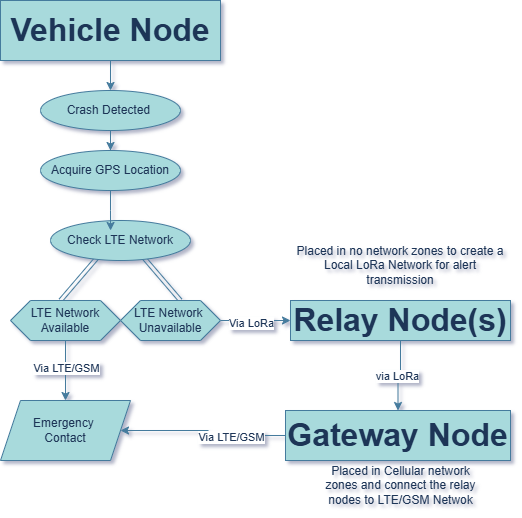

# CrashLink 

## Overview
CrashLink is a hybrid LTE + LoRa based emergency alert system.It enables accident alerts to be transmitted even from areas with no cellular network coverage.

## Problem
Many accidents happens in areas with low cellular connectivity which delays the emergency response and
notifications.

## Solutions
CrashLink uses
-Vehicle nodes
-Relay nodes
-Gateway nodes

LTE is used when coverage exists. LoRa acts as a backup communication network when LTE is unavailable.

## Current Progress
- [done] System architecture designed
- [done] Vehicle Node schematic completed
- [done] Vehicle Node PCB designed
- [done] Vehicle Node gerbers generated
- [done] Relay Node schematics completed
- [done] Relay Node PCB designed
- [] Relay Node gerbers generated
- [] Gateway Node schematics completed
- [] Gateway Node PCB designed
- [] Gateway Node gerbers generated
- [] Prototype assembly
- [] Firmware development

## Hardware
- ESP32
- SX1278 LoRa
- A7670 LTE
- NEO-6M GPS
- MPU6050

## Images

## PCB Layout

## 3D Render

## System Architecture

